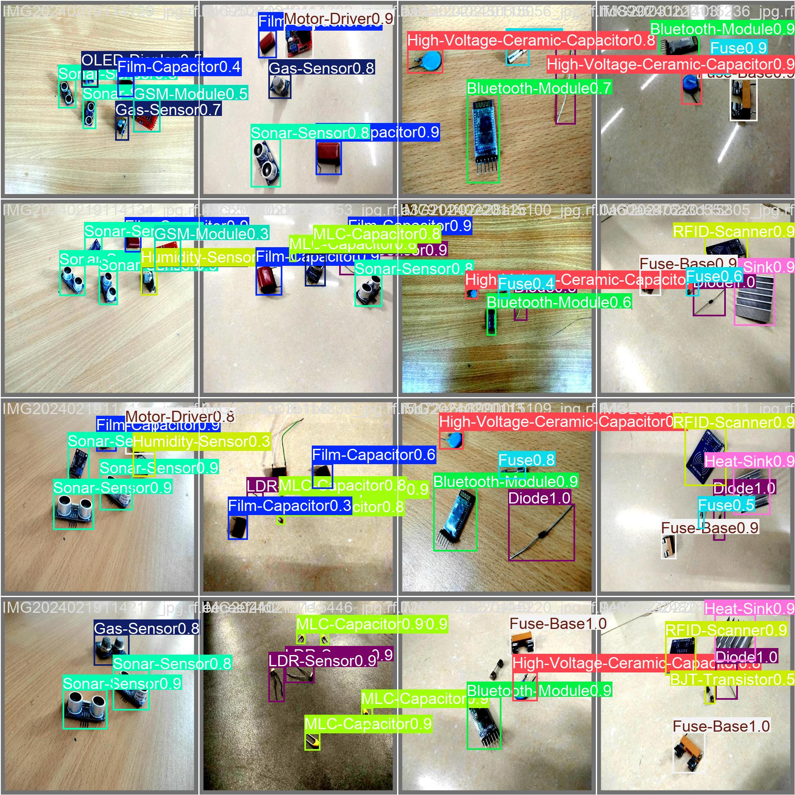
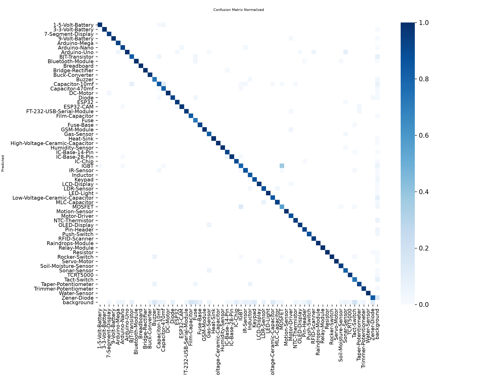
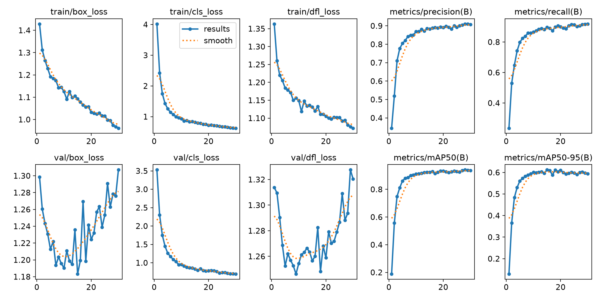

# Electronic Component Detector

Detects and classifies electronic components in a photo: resistors, ICs, sensors, microcontrollers, 61 classes total. Upload an image, get back bounding boxes and labels.

**[Live demo →](https://electronic-component-classifier.onrender.com)**

Hosted on Render's free tier, so the first request after some idle time takes a few seconds to wake up.



yolo11s was chosen over the smaller yolo11n after testing. On 61 fine-grained classes, the extra capacity noticeably outperformed the nano variant.

## Tech stack

Model: YOLO11s (Ultralytics), exported to ONNX for CPU inference. Backend: FastAPI + Uvicorn. Frontend: React + TypeScript (Vite). Deployment: Docker, multi-stage build, hosted on Render.

## How it works

Upload a photo, the backend runs it through a fine-tuned YOLO11s model, boxes and labels get drawn on the image in the browser. Frontend is built to static files and served directly by FastAPI, so it's one container and no CORS to deal with.

## EDA findings

**Class imbalance**: most common class has several times more instances than the rarest.

**Box-level duplicate labels**: found and fixed via an IoU check. Same object labeled twice in a handful of images.

**Train/valid/test split problem**: 16 of 61 classes had zero representation in valid and test, so they couldn't be evaluated at all. Fixed by moving 10% of each affected class's images into each split, prioritizing images with fewer objects to minimize side effects on other classes.

**Small object risk**: computed bounding box size per class. Classes with the smallest median box area were expected to underperform regardless of instance count, since small boxes get overshadowed by larger co-occurring components.

**Cross-split image leakage**: checked via MD5 hash comparison across all three splits. None found, so validation/test metrics are safe to trust.

**Missing-label rate**: manual audit of 20 random train images found 0 with unlabeled objects. Assumed rare given the low rate, not addressed further.

## Evaluation

**Overall**: precision 0.885, recall 0.895, mAP50 0.922, mAP50-95 0.612 on the validation set.

**Overfitting check**: val losses bottomed out around epoch 10 and crept up afterward, but val precision/recall/mAP stayed stable through the same period, so the best checkpoint (picked by mAP50-95) wasn't affected.




**Worst performing classes**: Zener-Diode, Tact-Switch, BJT-Transistor, Low-Voltage-Ceramic-Capacitor, Buzzer, Keypad, IGBT, MOSFET, Push-Switch, MLC-Capacitor, Fuse, LDR-Sensor, Capacitor-10mf, Diode, TCRT5000.

**Small-object prediction held up**: 9 of 15 classes flagged as at-risk by the EDA bounding-box-size check actually underperformed. The rest performed fine anyway.

**Second failure mode, not predicted by box size**: Zener-Diode, IGBT, MOSFET, Capacitor-10mf, Diode all underperform despite normal box sizes. These are visually similar components. The confusion matrix shows a real off-diagonal signal between IGBT and MOSFET specifically. Class-similarity confusion, not a small-object problem.

**Third, unexplained**: Keypad also underperforms, but gets confused with background rather than another class or a box-size issue. Doesn't fit either pattern above, still unresolved.

## ONNX export for CPU inference

Render's free tier gives you 0.1 CPU and 512MB of RAM, no GPU. On raw PyTorch, that meant ~60s per request. Exported the model to ONNX and switched inference to ONNX Runtime's CPU execution provider instead: same weights, same accuracy, faster runtime, cutting latency to ~12s. The remaining wait is a hosting limitation, not a model problem: the same model runs in under a second on GPU locally.

Also hit an out-of-memory crash along the way: `pip install torch` was quietly grabbing the full CUDA build (several GB of NVIDIA libraries) on an instance that would never touch any of it. Fixed by installing the CPU-only build explicitly, before `ultralytics` could pull it in on its own.

## Running locally

```bash
git clone https://github.com/Lun4R-420/electronic-component-classifier.git
cd electronic-component-classifier
```

Docker, matches production:
```bash
docker build -t component-detector .
docker run -p 8000:8000 component-detector
```
Then open `http://localhost:8000`.

Backend only:
```bash
pip install -r requirements.txt
uvicorn src.api:app --reload
```

Frontend dev server, hot reload:
```bash
cd frontend
npm install
npm run dev
```
